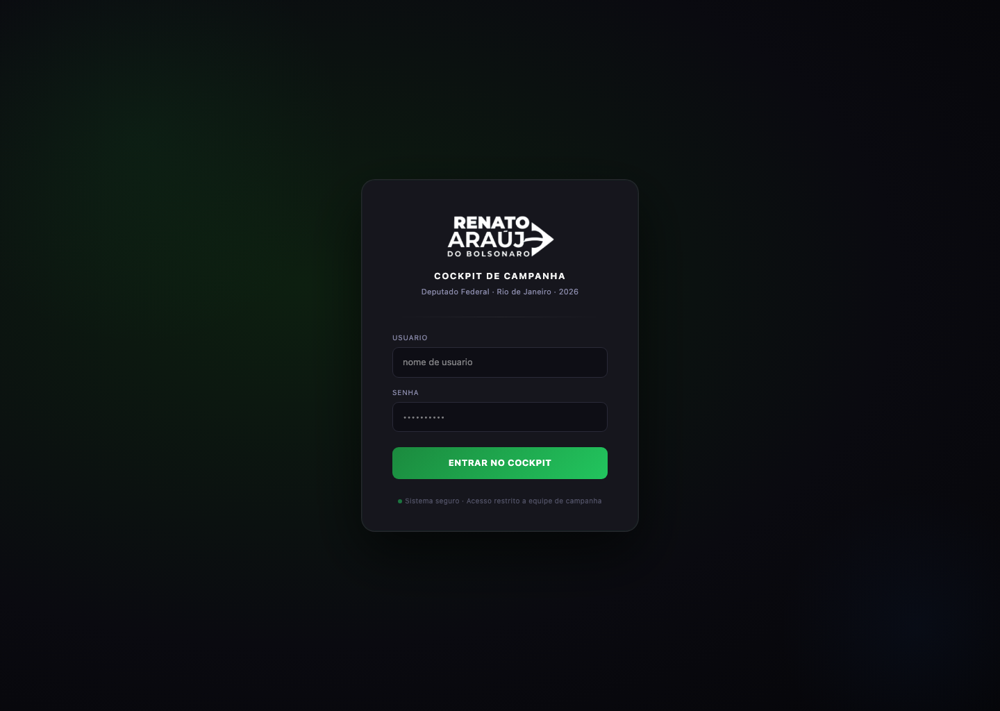
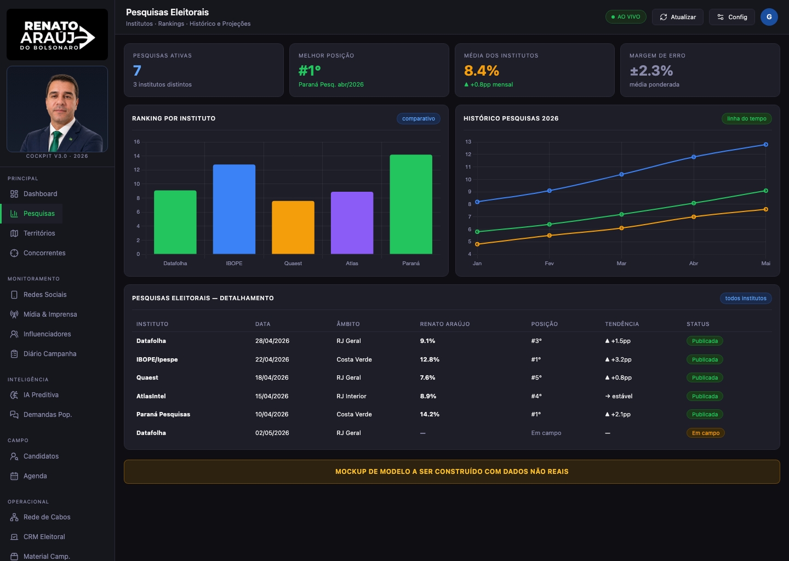
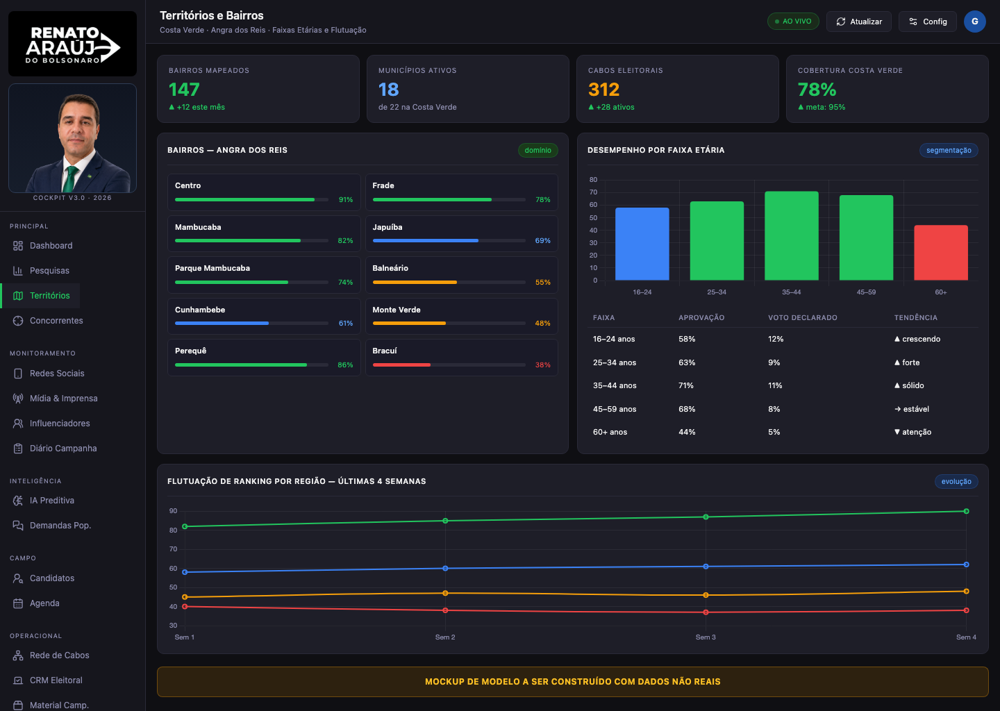
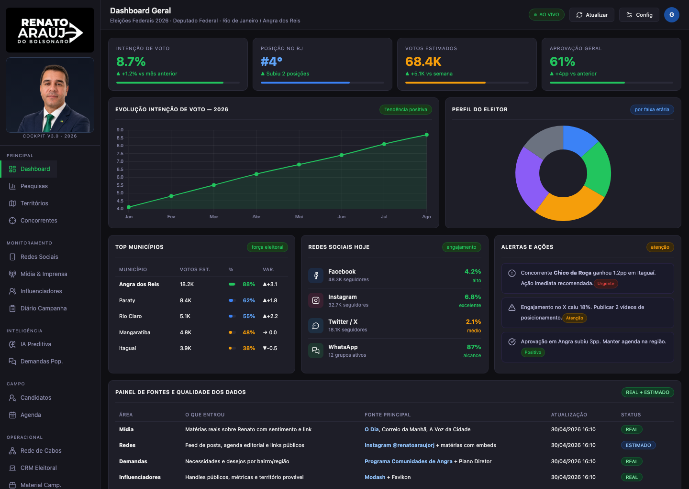
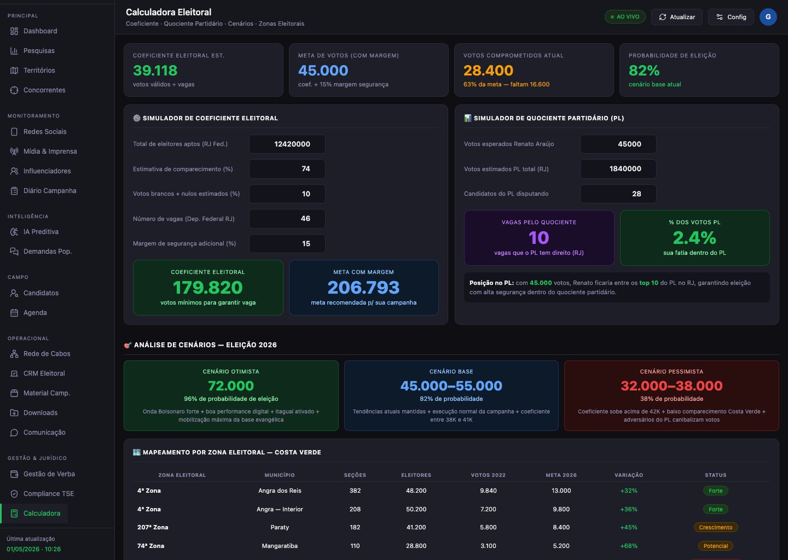
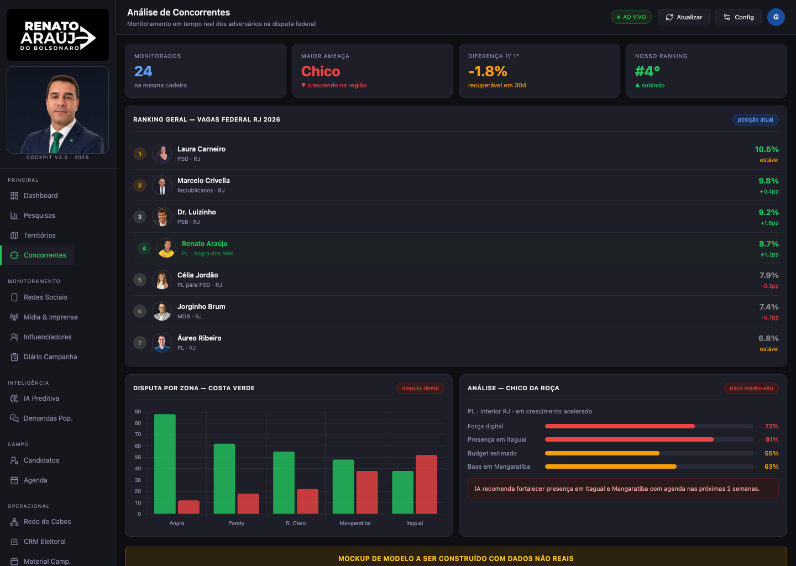
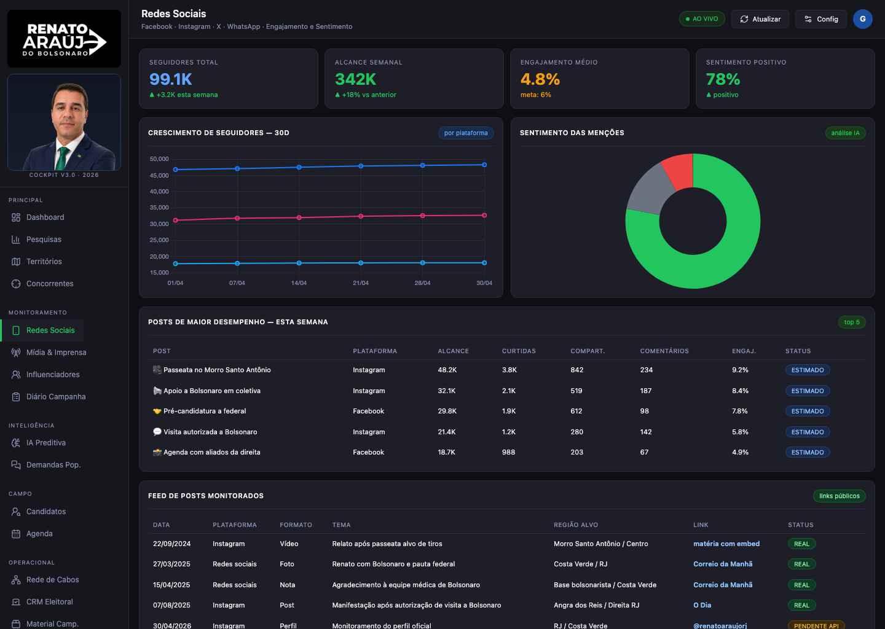
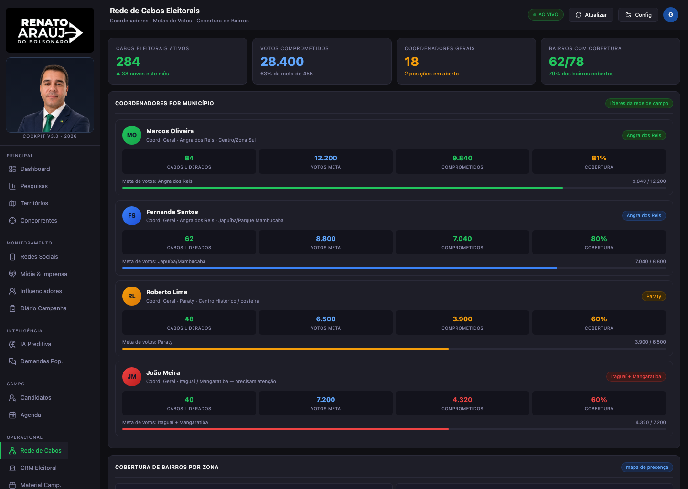
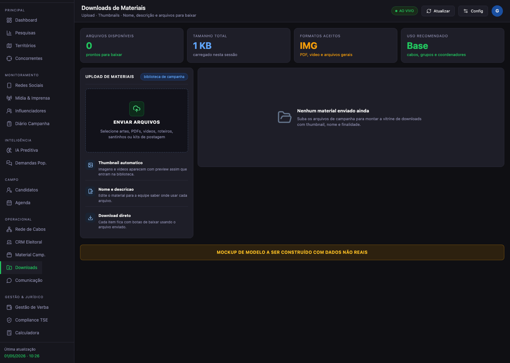
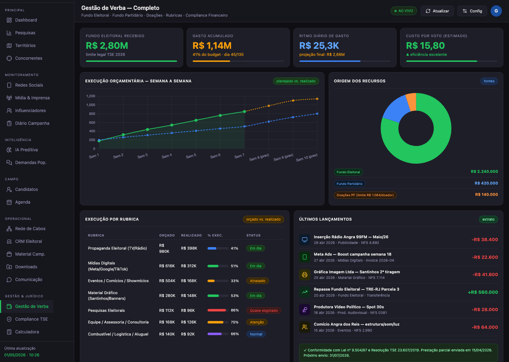

# Design & Frontend — politica-cockpit

Documento de planejamento de design, arquitetura de componentes e roadmap de migração para o cockpit de campanha eleitoral.

---

## 1. Visao Geral e Objetivos

### O que e o produto

O **politica-cockpit** e um SaaS de campanha eleitoral que reune duas experiencias em uma unica aplicacao Next.js:

1. **Landing page publica** — vitrine da assessoria politica com CTA de WhatsApp, formulario de voluntarios e acesso ao cockpit via modal de login (protegido por ALTCHA anti-bot + JWT).
2. **Cockpit autenticado** — painel de comando com ~20 secoes cobrindo dashboard, pesquisas, territorios, concorrentes, redes sociais, candidatos, cabos eleitorais, CRM eleitoral, financeiro, compliance TSE, calculadora eleitoral, downloads e comunicacao.

### Para quem

- **Candidato e coordenacao de campanha** — tomam decisoes com dados consolidados.
- **Equipe operacional** — cabos eleitorais, social media, assessores, videomakers.
- **Visitantes publicos** — potenciais clientes da assessoria politica.

### Meta de UX

Transformar o cockpit de um mockup estatico com HTML hardcoded em uma aplicacao React moderna, performatica e alimentada por dados reais via Supabase, mantendo a identidade visual escura e profissional ja estabelecida.

**Metricas-alvo:**
- LCP < 2.5s em conexao 4G
- CLS < 0.1
- Tempo de interacao ate primeira acao no cockpit < 3s apos login
- Zero `dangerouslySetInnerHTML` no codebase final

---

## 2. Design Tokens

### 2.1 Cores

As cores atuais do cockpit seguem um tema escuro. Os tokens abaixo consolidam o que ja existe em `globals.css` com nomes semanticos:

| Token | Hex | Uso |
|-------|-----|-----|
| `--color-bg` | `#0f0f13` | Fundo principal da aplicacao |
| `--color-surface` | `#16161d` | Sidebar, topbar, paineis |
| `--color-card` | `#1e1e28` | Cards, containers de conteudo |
| `--color-border` | `#2a2a38` | Bordas de cards, divisores, separadores |
| `--color-text-primary` | `#f0f0f0` | Texto principal, titulos |
| `--color-text-secondary` | `#8a8aaa` | Labels, subtitulos, metadados |
| `--color-success` | `#22c55e` | Indicadores positivos, CTA principal, badges verdes |
| `--color-danger` | `#ef4444` | Alertas criticos, quedas, erros |
| `--color-warning` | `#f59e0b` | Atencao, prazos proximos, itens pendentes |
| `--color-info` | `#60a5fa` | Informacoes neutras, links, badges azuis |
| `--color-accent` | `#8b5cf6` | IA, insights, destaques roxos |
| `--color-verde-partido` | `#1B8A3E` | Verde institucional do partido/candidato |
| `--color-azul-partido` | `#1A4FA0` | Azul institucional |
| `--color-amarelo-partido` | `#F0C030` | Amarelo institucional |

**Cores da landing page** (tema proprio, mais escuro):

| Token | Hex | Uso |
|-------|-----|-----|
| `--landing-bg` | `#05070a` | Fundo da landing page |
| `--landing-card` | `#0e141d` | Cards de features |
| `--landing-border` | `rgba(255,255,255,0.10)` | Bordas sutis |
| `--landing-text` | `#f8fafc` | Texto principal da landing |
| `--landing-text-muted` | `#b7c3d4` | Texto secundario landing |
| `--landing-cta` | `#22c55e` | Botoes de acao principal |

### 2.2 Tipografia

| Variante | Fonte | Tamanho | Peso | Line-height | Uso |
|----------|-------|---------|------|-------------|-----|
| `display-xl` | System UI | 78px | 900 | 0.92 | Hero H1 landing |
| `display-lg` | Oswald | 48px | 300 | 1.08 | Titulos de secao landing |
| `display-md` | System UI | 42px | 900 | 1.08 | H2 landing sections |
| `heading-lg` | System UI | 18px | 700 | 1.2 | Titulo de detalhe candidato |
| `heading-md` | System UI | 16px | 600 | 1.2 | Titulo de pagina cockpit |
| `heading-sm` | System UI | 13px | 700 | 1.2 | Nome de candidato, card title |
| `body-md` | System UI | 16px | 400 | 1.65 | Texto corrido landing |
| `body-sm` | System UI | 13px | 400 | 1.45 | Texto landing hero |
| `label-lg` | System UI | 12px | 600 | 1.4 | Labels de tabela, nomes |
| `label-md` | System UI | 11px | 500 | 1.4 | Card titles cockpit, nav items |
| `label-sm` | System UI | 10px | 500 | 1.3 | KPI labels, subtextos, badges |
| `label-xs` | System UI | 9px | 700 | 1.2 | Nav section labels, versao |
| `mono-sm` | System UI | 11px | 600 | 1 | Valores numericos, percentuais |

**Observacao sobre fontes:** O design original referencia Oswald e Inter. Atualmente o codebase usa `'Segoe UI', system-ui, -apple-system, sans-serif`. A migracao para fontes via `next/font` e descrita na Fase 1.

### 2.3 Spacing Scale

Base unit: **4px**

| Token | Valor | Uso |
|-------|-------|-----|
| `--space-1` | 4px | Gap minimo, margem interna micro |
| `--space-2` | 8px | Gap entre badges, padding pequeno |
| `--space-3` | 12px | Gap de grid, padding de cards |
| `--space-4` | 16px | Padding de conteudo, margin between sections |
| `--space-5` | 20px | Padding de topbar |
| `--space-6` | 24px | Margin entre blocos |
| `--space-8` | 32px | Espacamento de secoes |
| `--space-10` | 40px | Padding do login card |
| `--space-12` | 48px | Padding vertical de secoes |
| `--space-16` | 64px | Margin vertical de secoes landing |
| `--space-24` | 96px | Padding de secoes landing (92px arredondado) |

### 2.4 Radii, Shadows, Blur

| Token | Valor | Uso |
|-------|-------|-----|
| `--radius-sm` | 3px | Scrollbar thumb, mini bars |
| `--radius-md` | 6px | Badges, bairro items, botoes pequenos |
| `--radius-lg` | 8px | Cards landing, feature cards, botoes |
| `--radius-xl` | 10px | Cards do cockpit, KPI cards |
| `--radius-2xl` | 20px | Login card, badges pill |
| `--radius-full` | 9999px | Avatares, dots, badges circulares |
| `--shadow-card` | `0 32px 80px rgba(0,0,0,0.6)` | Login card, modais |
| `--shadow-screen` | `0 18px 60px rgba(0,0,0,0.24)` | Screenshots, imagens landing |
| `--shadow-subtle` | `rgba(0,0,0,0.05) 0px 1px 2px` | Elevacao minima |
| `--blur-surface` | `blur(16px)` | Navbar landing, login card, glassmorphism |
| `--blur-light` | `blur(8px)` | Paineis glass secundarios |

---

## 3. Estado Atual vs. Alvo

### 3.1 CSS Monolitico (1374 linhas)

**Estado atual:**
O arquivo `app/globals.css` contem 1374 linhas de CSS puro com classes como `.kpi-card`, `.cand-card`, `.landing-hero`, `.cabo-card`, etc. Todas as secoes do cockpit e da landing page sao estilizadas por esse unico arquivo. Nao ha co-localizacao de estilos com componentes.



**Alvo:**
- Cada componente React usa classes Tailwind diretamente no JSX.
- `globals.css` reduzido a < 50 linhas: imports do Tailwind, definicao de custom properties (tokens), reset minimo e estilos do ALTCHA widget (web component externo que nao aceita Tailwind).
- Classes utilitarias via `cn()` de `lib/utils.ts` para merge condicional.

### 3.2 dangerouslySetInnerHTML e HTML Hardcoded

**Estado atual:**
O arquivo `components/campaign-data.ts` (952 linhas) exporta um objeto `campaignSections` onde cada secao do cockpit e uma **string de HTML bruto** com dados inlined:

```typescript
export const campaignSections = {
  "dashboard": "<div id=\"sec-dashboard\" class=\"section active\">\n <div class=\"kpi-row\">...",
  "pesquisas": "<div id=\"sec-pesquisas\" class=\"section\">...",
  // ... ~15 secoes
};
```

Em `campaign-cockpit.tsx`, esse HTML e renderizado via:
```tsx
<div dangerouslySetInnerHTML={{ __html: activeMarkup ?? "" }} />
```



**Alvo:**
- Cada secao vira um componente React independente (`DashboardSection`, `PesquisasSection`, etc.).
- Dados vem de props tipadas ou de queries Supabase.
- `campaign-data.ts` e eliminado completamente.
- Zero uso de `dangerouslySetInnerHTML`.

### 3.3 Lucide Icons: CDN + npm duplicado

**Estado atual:**
- `lucide-react` esta instalado via npm (v1.14.0) e usado na `login-screen.tsx` com imports nomeados.
- Simultaneamente, o cockpit carrega Lucide via CDN (`unpkg.com/lucide@0.468.0/dist/umd/lucide.min.js`) com `next/script` e chama `window.lucide.createIcons()` para renderizar icones em HTML strings (`<i data-lucide="...">`).
- Isso resulta em **dois bundles de icones** carregados.

**Alvo:**
- Remover `<Script src="unpkg.com/lucide...">` de `campaign-cockpit.tsx`.
- Remover `window.lucide?.createIcons()` e a declaracao `Window.lucide`.
- Todos os icones via `import { IconName } from "lucide-react"` nos componentes React.
- Tree-shaking natural: so icones usados entram no bundle.

### 3.4 Supabase Instalado mas Nao Integrado

**Estado atual:**
- `@supabase/supabase-js` (v2.105.1) e `@supabase/ssr` (v0.10.2) estao no `package.json`.
- `lib/auth.ts` existe mas a autenticacao usa JWT artesanal via `/api/auth/login`.
- Nenhum dado do cockpit vem do Supabase — tudo e hardcoded em `campaign-data.ts`.

**Alvo:**
- Auth via Supabase Auth com `@supabase/ssr` para cookies httpOnly.
- Dados de cada secao em tabelas Supabase com RLS.
- Server Components fazem fetch direto; Client Components usam hooks com cache.

### 3.5 Navegacao e Secoes por Estado Imperativo

**Estado atual:**
- A sidebar renderiza botoes que chamam `setActiveSection()`.
- A "navegacao" e um `useState` que controla qual bloco de HTML e injetado.
- Nao ha rotas Next.js — tudo roda em uma unica pagina (`/`).
- Nao ha URLs compartilhaveis para secoes especificas.



**Alvo:**
- Cada secao do cockpit e uma rota: `/cockpit/dashboard`, `/cockpit/pesquisas`, etc.
- Sidebar usa `<Link>` com `usePathname()` para active state.
- Layout compartilhado em `app/cockpit/layout.tsx` com sidebar + topbar.
- URLs compartilhaveis e navegacao via browser (back/forward funcionam).

### 3.6 Sem Testes

**Estado atual:**
- `@playwright/test` esta instalado nas devDependencies.
- Nenhum teste existe no repositorio.

**Alvo:**
- Testes E2E Playwright para fluxo critico: landing → login → dashboard → navegacao → logout.
- Lighthouse CI integrado para metricas de performance.

---

## 4. Arquitetura de Componentes

### 4.1 Estrutura de Pastas Alvo

```
app/
  (public)/
    page.tsx                    # Landing page (Server Component)
    layout.tsx                  # Layout publico
  cockpit/
    layout.tsx                  # Shell autenticado: sidebar + topbar + Suspense
    page.tsx                    # Redirect para /cockpit/dashboard
    dashboard/
      page.tsx                  # DashboardSection
    pesquisas/
      page.tsx
    territorios/
      page.tsx
    concorrentes/
      page.tsx
    redes-sociais/
      page.tsx
    candidatos/
      page.tsx
      [key]/
        page.tsx                # Detalhe do candidato
    cabos-eleitorais/
      page.tsx
    crm/
      page.tsx
    financeiro/
      page.tsx
    compliance/
      page.tsx
    calculadora/
      page.tsx
    downloads/
      page.tsx
    comunicacao/
      page.tsx
  api/
    auth/
      login/route.ts
      session/route.ts
      logout/route.ts
    altcha/
      challenge/route.ts
  globals.css
  layout.tsx                    # Root layout

components/
  ui/                           # Atoms (shadcn/ui + custom)
    button.tsx                  # Ja existe
    card.tsx                    # Ja existe
    badge.tsx
    kpi-card.tsx
    mini-bar.tsx
    data-table.tsx
    chart-wrapper.tsx
    icon-badge.tsx
  layout/                       # Organismos de layout
    sidebar.tsx
    topbar.tsx
    cockpit-shell.tsx
  landing/                      # Componentes da landing
    hero.tsx
    command-strip.tsx
    feature-grid.tsx
    service-summary.tsx
    product-showcase.tsx
    benefits-grid.tsx
    gallery.tsx
    lgpd-section.tsx
    crm-section.tsx
    volunteer-form.tsx
    final-cta.tsx
    nav.tsx
    login-modal.tsx
  sections/                     # Secoes do cockpit
    dashboard-section.tsx
    pesquisas-section.tsx
    territorios-section.tsx
    concorrentes-section.tsx
    redes-sociais-section.tsx
    candidatos-section.tsx
    cabos-section.tsx
    crm-section.tsx
    financeiro-section.tsx
    compliance-section.tsx
    calculadora-section.tsx
    comunicacao-section.tsx

lib/
  auth.ts                       # Ja existe
  utils.ts                      # cn() ja existe
  supabase/
    client.ts                   # createBrowserClient
    server.ts                   # createServerClient
    middleware.ts               # updateSession helper
  hooks/
    use-countdown.ts
    use-section-data.ts

types/
  campaign.ts                   # Tipos compartilhados de dados
  database.ts                   # Tipos gerados do Supabase schema
```

### 4.2 Hierarquia de Componentes (Atomic Design)

#### Atoms (`components/ui/`)

Componentes atomicos sem logica de negocio:

| Componente | Descricao | Props principais |
|------------|-----------|------------------|
| `Badge` | Pill colorido | `variant: 'verde' \| 'azul' \| 'amarelo' \| 'vermelho' \| 'roxo' \| 'cinza'` |
| `KpiCard` | Card com label, valor, subtexto, barra | `label, value, subtitle, progress, color` |
| `MiniBar` | Barra de progresso inline | `value: number, max: number, color` |
| `DataTable` | Tabela estilizada | `columns, data, onRowClick?` |
| `ChartWrapper` | Container para Chart.js com resize | `type, data, options, height` |
| `IconBadge` | Badge com icone Lucide | `icon: LucideIcon, variant?` |
| `AlertBox` | Caixa de alerta | `variant: 'red' \| 'green', children` |

#### Molecules (composicoes reutilizaveis)

| Componente | Composicao |
|------------|------------|
| `RankItem` | Avatar + info + valor + delta |
| `SocialRow` | Icone plataforma + metricas |
| `CandidateCard` | Foto + nome + partido + stats |
| `ComplianceItem` | Status icon + info + prazo |
| `CaboCard` | Avatar + nome + area + stats grid |
| `LancamentoRow` | Icone + descricao + valor |
| `MaterialItem` | Icone + info + estoque |

#### Organisms (`components/sections/`)

Cada secao do cockpit e um organismo auto-contido:

| Organismo | Conteudo | Referencia visual |
|-----------|----------|-------------------|
| `DashboardSection` | KPI row + graficos + agenda | `capturas-recursos/pagina3.png` |
| `PesquisasSection` | Graficos de intencao + perfil eleitor | `capturas-recursos/pagina5.png` |
| `TerritoriosSection` | Mapa de forca + bairros + bars | `capturas-recursos/pagina5.png` |
| `ConcorrentesSection` | Ranking + comparativo | `capturas-recursos/pagina6.png` |
| `RedesSociaisSection` | Metricas por plataforma + influenciadores | `capturas-recursos/pagina6.png` |
| `CandidatosSection` | Grid de cards + detalhe | `capturas-recursos/pagina7.jpg.png` |
| `CabosSection` | Lista de cabos + performance | `capturas-recursos/pagina7.jpg.png` |
| `CrmSection` | Funil + multiplicadores + meta | `capturas-recursos/pagina8.jpg.png` |
| `FinanceiroSection` | Orcamento + lancamentos | `capturas-recursos/pagina8.jpg.png` |
| `ComplianceSection` | Checklist + timeline prazos | `capturas-recursos/pagina10.png` |
| `CalculadoraSection` | Inputs + resultados + cenarios | `capturas-recursos/pagina10.png` |
| `DownloadsSection` | Upload + grid de materiais | `capturas-recursos/pagina9.png` |
| `ComunicacaoSection` | Grupos WhatsApp + templates + calendario | — |

#### Templates (`app/cockpit/layout.tsx`)

```
+------+------------------------------------------+
|      |  Topbar (titulo, breadcrumb, countdown)   |
| Side |------------------------------------------+
| bar  |                                          |
|      |  <Suspense fallback={<SectionSkeleton>}> |
|      |    {children} (page.tsx da rota)          |
|      |  </Suspense>                              |
|      |                                          |
+------+------------------------------------------+
```

### 4.3 Plano de Migracao do CSS

**Estrategia: componente por componente, de fora para dentro.**

1. **Criar tokens Tailwind** no `tailwind.config` mapeando as CSS custom properties.
2. **Migrar o shell** (sidebar, topbar, layout) — sao os containers de tudo.
3. **Migrar atoms** (badges, KPI cards, bars) — sao reutilizados em todas as secoes.
4. **Migrar uma secao por vez** — cada secao substitui seu bloco de HTML em `campaign-data.ts` por componentes React com Tailwind.
5. **Remover CSS morto** — a cada secao migrada, as classes correspondentes saem de `globals.css`.
6. **Validar** — quando `campaign-data.ts` estiver vazio, deletar o arquivo e o `dangerouslySetInnerHTML`.

**Mapeamento de classes CSS para Tailwind (exemplos):**

| Classe CSS atual | Tailwind equivalente |
|------------------|---------------------|
| `.card` | `bg-[--color-card] border border-[--color-border] rounded-[10px] p-3.5` |
| `.kpi-row` | `grid grid-cols-4 gap-2.5 mb-3.5` |
| `.kpi-value` | `text-[26px] font-bold leading-none` |
| `.card-title` | `text-[11px] font-semibold uppercase tracking-wide` |
| `.badge-verde` | `bg-green-900/40 text-green-400 border border-green-500/20 text-[10px] px-2 py-0.5 rounded-full` |
| `.up` | `text-green-400` |
| `.down` | `text-red-400` |
| `.warn` | `text-amber-400` |

---

## 5. Plano de Fases

### Fase 1 — Design System & Tokens (fundacao)

**Objetivo:** Estabelecer a base tecnica para que todas as fases seguintes usem tokens consistentes e componentes padronizados.

#### Tarefas

1. **Configurar Tailwind com tokens customizados**
   - Criar `tailwind.config.ts` (atualmente sem config explicito — Tailwind 4 usa `@import "tailwindcss"` em `globals.css`)
   - Mapear todas as CSS custom properties de `globals.css` para o tema Tailwind
   - Definir `colors`, `spacing`, `borderRadius`, `boxShadow`, `backdropBlur` no tema
   - Exemplo:
     ```typescript
     // tailwind.config.ts
     import type { Config } from "tailwindcss";

     const config: Config = {
       content: ["./app/**/*.{ts,tsx}", "./components/**/*.{ts,tsx}"],
       theme: {
         extend: {
           colors: {
             bg: "var(--color-bg)",
             surface: "var(--color-surface)",
             card: "var(--color-card)",
             border: "var(--color-border)",
             "text-primary": "var(--color-text-primary)",
             "text-secondary": "var(--color-text-secondary)",
             success: "var(--color-success)",
             danger: "var(--color-danger)",
             warning: "var(--color-warning)",
             info: "var(--color-info)",
             accent: "var(--color-accent)",
           },
         },
       },
     };

     export default config;
     ```

2. **Adicionar Oswald + Inter via `next/font`**
   - Instalar e configurar em `app/layout.tsx`:
     ```typescript
     import { Oswald, Inter } from "next/font/google";

     const oswald = Oswald({
       subsets: ["latin"],
       weight: ["300", "400", "700"],
       variable: "--font-oswald",
     });

     const inter = Inter({
       subsets: ["latin"],
       variable: "--font-inter",
     });
     ```
   - Aplicar classes de variavel CSS no `<body>`.
   - Atualizar tokens de tipografia para referenciar `font-oswald` e `font-inter`.

3. **Padronizar icones em `lucide-react`**
   - Remover `<Script src="unpkg.com/lucide...">` de `campaign-cockpit.tsx`.
   - Remover `window.lucide?.createIcons()` e `declare global { interface Window { lucide?... } }`.
   - Em cada componente migrado, importar icones diretamente: `import { LayoutDashboard, Search, Map } from "lucide-react"`.
   - Os icones da sidebar (`campaign-config.ts`) mudam de `icon: "layout-dashboard"` (string para CDN) para `icon: LayoutDashboard` (componente React).

4. **Reduzir `globals.css`**
   - Mover tokens para bloco `:root` com nomes semanticos.
   - Manter apenas: imports Tailwind, custom properties, reset de `box-sizing`, estilos do ALTCHA widget.
   - Alvo: < 80 linhas.

#### Criterios de aceite

- [ ] `globals.css` tem < 80 linhas
- [ ] Nenhum `<Script>` de CDN externo no codebase
- [ ] `window.lucide` nao existe no codebase
- [ ] Oswald e Inter carregam via `next/font` (verificavel no Network tab)
- [ ] Tokens de cor, spacing e radii acessiveis via classes Tailwind
- [ ] `npm run build` passa sem erros

---

### Fase 2 — Landing Page (conversao)

**Objetivo:** Reescrever a landing page como componentes React puros, eliminando a dependencia de `globals.css` para estilizacao e melhorando a performance de carregamento.

**Referencia visual:**




#### Tarefas

1. **Extrair componentes da landing**
   - A `login-screen.tsx` atual tem 749 linhas e renderiza a landing inteira + modal de login.
   - Extrair para componentes em `components/landing/`:
     - `nav.tsx` — navbar fixa com blur
     - `hero.tsx` — hero section com imagem de fundo e CTAs
     - `command-strip.tsx` — metricas em grid
     - `feature-grid.tsx` — cards de pilares estrategicos
     - `service-summary.tsx` — texto + imagem lado a lado
     - `product-showcase.tsx` — descricao do SaaS + screenshots
     - `benefits-grid.tsx` — 20 beneficios em grid
     - `gallery.tsx` — galeria de fotos de mobilizacao
     - `lgpd-section.tsx` — permitido vs proibido
     - `crm-section.tsx` — CRM flow + formulario
     - `volunteer-form.tsx` — formulario de cadastro
     - `final-cta.tsx` — CTA final
     - `login-modal.tsx` — modal de login com ALTCHA

2. **Converter estilos para Tailwind**
   - Cada componente usa classes Tailwind em vez de classes CSS de `globals.css`.
   - Exemplo de conversao do hero:
     ```tsx
     // Antes: className="landing-hero" (definido em globals.css)
     // Depois:
     <section className="relative min-h-[86dvh] flex items-end px-8 py-28 overflow-hidden">
     ```

3. **Implementar animacoes GSAP ScrollTrigger**
   - Instalar `gsap` e `@gsap/react`.
   - Animar entrada dos feature cards, command strip, gallery com `ScrollTrigger`.
   - Manter `150ms ease` para micro-interacoes (hovers, focus).
   - Usar `cubic-bezier(0.4,0,0.2,1)` para transicoes de layout.

4. **Glassmorphism nos cards e navbar**
   - Navbar: `backdrop-blur-[16px] bg-[#05070a]/82`.
   - Login card: `backdrop-blur-[16px] bg-[#16161d]/95`.
   - Feature cards: borda sutil + fundo semi-transparente.

5. **Otimizar imagens**
   - Substituir `` por `<Image>` do Next.js para lazy loading e otimizacao automatica.
   - Definir `sizes` e `priority` para a hero image.

#### Criterios de aceite

- [ ] `login-screen.tsx` nao existe mais (funcionalidade distribuida em componentes)
- [ ] Cada componente da landing tem < 120 linhas
- [ ] Nenhuma classe `.landing-*` existe em `globals.css`
- [ ] GSAP ScrollTrigger funciona em scroll (elementos entram com fade-up)
- [ ] Lighthouse Performance score > 80 na landing
- [ ] Modal de login abre e fecha corretamente
- [ ] ALTCHA widget funciona dentro do modal
- [ ] Formulario de voluntario envia dados (ou mostra feedback)
- [ ] Responsivo: mobile (< 760px), tablet (< 1180px), desktop

---

### Fase 3 — Auth & Middleware (seguranca)

**Objetivo:** Substituir o JWT artesanal por Supabase Auth, proteger rotas do cockpit via middleware Next.js.



#### Tarefas

1. **Configurar Supabase Auth**
   - Criar projeto Supabase (ou usar existente).
   - Configurar variaveis de ambiente:
     ```
     NEXT_PUBLIC_SUPABASE_URL=
     NEXT_PUBLIC_SUPABASE_ANON_KEY=
     SUPABASE_SERVICE_ROLE_KEY=
     ```
   - Criar `lib/supabase/client.ts` (browser) e `lib/supabase/server.ts` (server).

2. **Criar middleware de protecao**
   ```typescript
   // middleware.ts
   import { type NextRequest, NextResponse } from "next/server";
   import { updateSession } from "@/lib/supabase/middleware";

   export async function middleware(request: NextRequest) {
     return await updateSession(request);
   }

   export const config = {
     matcher: ["/cockpit/:path*"],
   };
   ```

3. **Migrar login**
   - Manter ALTCHA como step 1 (anti-bot) — so apos verificacao ALTCHA o form submete.
   - Step 2: `supabase.auth.signInWithPassword({ email, password })`.
   - Remover `/api/auth/login` e `/api/auth/session` artesanais.
   - Criar `/api/auth/logout` que chama `supabase.auth.signOut()`.

4. **Atualizar `lib/auth.ts`**
   - Remover logica JWT customizada.
   - Exportar helpers: `getUser()`, `requireAuth()`, `signOut()`.

#### Criterios de aceite

- [ ] Login via Supabase Auth funciona com email/senha
- [ ] ALTCHA continua ativo como pre-validacao no modal
- [ ] Acesso a `/cockpit/*` sem sessao redireciona para `/`
- [ ] Acesso a `/cockpit/*` com sessao valida renderiza o cockpit
- [ ] Nenhum JWT artesanal no codebase
- [ ] Logout limpa cookies e redireciona para `/`
- [ ] `npm run build` passa sem erros

---

### Fase 4 — Cockpit Shell (estrutura)

**Objetivo:** Criar o layout autenticado como componentes React com rotas Next.js, substituindo o sistema de secoes por estado.


#### Tarefas

1. **Criar `app/cockpit/layout.tsx`**
   ```tsx
   export default function CockpitLayout({ children }: { children: React.ReactNode }) {
     return (
       <div className="flex h-screen bg-[--color-bg] text-[--color-text-primary]">
         <Sidebar />
         <div className="flex flex-1 flex-col overflow-hidden min-w-0">
           <Topbar />
           <main className="flex-1 overflow-y-auto p-4">
             <Suspense fallback={<SectionSkeleton />}>
               {children}
             </Suspense>
           </main>
         </div>
       </div>
     );
   }
   ```

2. **Criar `components/layout/sidebar.tsx`**
   - Componente React com `usePathname()` para active state.
   - Responsivo: colapsa para 52px em telas < 900px.
   - Logo, foto do candidato, navegacao por grupos, footer com ultima atualizacao.
   - Cada item usa `<Link href="/cockpit/{section}">`.
   - Icones via `lucide-react` (nao mais strings para CDN).

3. **Criar `components/layout/topbar.tsx`**
   - Titulo e subtitulo derivados da rota ativa.
   - Badge "AO VIVO" com dot pulsante.
   - Countdown para eleicao (hook `useCountdown`).
   - Botoes: Atualizar, Config, Avatar.

4. **Criar rotas basicas**
   - `app/cockpit/page.tsx` — redirect para `/cockpit/dashboard`.
   - `app/cockpit/dashboard/page.tsx` — placeholder com `<DashboardSection />`.
   - Demais rotas: placeholder com nome da secao (migradas na Fase 5).

5. **Remover `campaign-cockpit.tsx`**
   - O componente monolitico e substituido pelo layout + rotas.
   - Remover `campaign-config.ts` (navegacao agora e declarativa no sidebar).

#### Criterios de aceite

- [ ] Sidebar renderiza todos os grupos de navegacao
- [ ] Click em item da sidebar navega para rota correspondente
- [ ] Item ativo destacado com borda verde e cor verde
- [ ] Sidebar colapsa em telas < 900px (so icones)
- [ ] Topbar mostra titulo correto para cada rota
- [ ] Countdown mostra dias ate 04/10/2026
- [ ] Browser back/forward funciona entre secoes
- [ ] URL e compartilhavel (ex: `/cockpit/pesquisas` carrega diretamente a secao)
- [ ] `campaign-cockpit.tsx` deletado
- [ ] `npm run build` passa sem erros

---

### Fase 5 — Secoes React (conteudo)

**Objetivo:** Converter cada secao de HTML hardcoded para componentes React tipados, eliminando `campaign-data.ts` e `dangerouslySetInnerHTML`.

**Referencia visual:**








#### Tarefas

Cada secao segue o mesmo processo:

1. Ler o HTML correspondente em `campaign-data.ts`.
2. Extrair os dados para constantes tipadas (ou futuramente para queries Supabase).
3. Criar o componente React com Tailwind.
4. Conectar graficos via `react-chartjs-2` (ja instalado).
5. Remover o bloco de HTML de `campaign-data.ts`.

**Ordem de migracao (por dependencia e complexidade):**

| Prioridade | Secao | Componente | Complexidade |
|------------|-------|------------|-------------|
| 1 | Dashboard | `dashboard-section.tsx` | Media (KPI + 4 graficos) |
| 2 | Pesquisas | `pesquisas-section.tsx` | Media (graficos + tabelas) |
| 3 | Territorios | `territorios-section.tsx` | Baixa (barras + grid bairros) |
| 4 | Concorrentes | `concorrentes-section.tsx` | Media (ranking + comparativo) |
| 5 | Redes Sociais | `redes-sociais-section.tsx` | Media (metricas + influenciadores) |
| 6 | Candidatos | `candidatos-section.tsx` | Alta (grid + detalhe interativo) |
| 7 | Cabos Eleitorais | `cabos-section.tsx` | Media (cards + stats) |
| 8 | CRM | `crm-section.tsx` | Media (funil + multiplicadores) |
| 9 | Financeiro | `financeiro-section.tsx` | Media (tabela orcamento + lancamentos) |
| 10 | Compliance TSE | `compliance-section.tsx` | Media (checklist + timeline) |
| 11 | Calculadora | `calculadora-section.tsx` | Alta (inputs reativos + cenarios) |
| 12 | Comunicacao | `comunicacao-section.tsx` | Media (WhatsApp + calendario editorial) |
| 13 | Downloads | Ja migrado (`campaign-downloads.tsx`) | — |
| 14 | Candidato Detalhe | Ja migrado (`candidate-detail.tsx`) | — |

**Tipagem de dados (exemplo para Dashboard):**

```typescript
// types/campaign.ts

export type KpiData = {
  label: string;
  value: string;
  subtitle: string;
  trend: "up" | "down" | "neutral";
  progress: number;       // 0-100
  color: string;          // hex
};

export type PollEvolution = {
  month: string;
  percentage: number;
};

export type VoteIntention = {
  candidate: string;
  party: string;
  percentage: number;
  color: string;
};
```

#### Criterios de aceite

- [ ] `campaign-data.ts` deletado
- [ ] Zero `dangerouslySetInnerHTML` no codebase
- [ ] Todas as 12 secoes renderizam como componentes React
- [ ] Graficos Chart.js renderizam via `react-chartjs-2`
- [ ] Calculadora eleitoral e interativa (inputs atualizam resultados em tempo real)
- [ ] Cada componente de secao tem < 250 linhas
- [ ] Tipos TypeScript definidos para todos os dados
- [ ] `npm run build` passa sem erros

---

### Fase 6 — Dados Reais via Supabase (backend)

**Objetivo:** Conectar o cockpit a dados reais armazenados no Supabase, com RLS e tipagem.

#### 6.1 Schema de Banco de Dados

```sql
-- Pesquisas e intencao de voto
CREATE TABLE polls (
  id UUID DEFAULT gen_random_uuid() PRIMARY KEY,
  poll_date DATE NOT NULL,
  source TEXT NOT NULL,
  candidate_name TEXT NOT NULL,
  party TEXT,
  percentage NUMERIC(5,2) NOT NULL,
  margin_of_error NUMERIC(4,2),
  sample_size INTEGER,
  created_at TIMESTAMPTZ DEFAULT now()
);

-- Territorios / bairros
CREATE TABLE territories (
  id UUID DEFAULT gen_random_uuid() PRIMARY KEY,
  name TEXT NOT NULL,
  region TEXT,
  electorate INTEGER,
  support_percentage NUMERIC(5,2),
  priority TEXT CHECK (priority IN ('alta', 'media', 'baixa')),
  updated_at TIMESTAMPTZ DEFAULT now()
);

-- Concorrentes
CREATE TABLE competitors (
  id UUID DEFAULT gen_random_uuid() PRIMARY KEY,
  name TEXT NOT NULL,
  party TEXT NOT NULL,
  number INTEGER,
  vote_intention NUMERIC(5,2),
  trend TEXT CHECK (trend IN ('up', 'down', 'stable')),
  photo_url TEXT,
  updated_at TIMESTAMPTZ DEFAULT now()
);

-- Redes sociais
CREATE TABLE social_metrics (
  id UUID DEFAULT gen_random_uuid() PRIMARY KEY,
  platform TEXT NOT NULL,
  followers INTEGER,
  engagement_rate NUMERIC(5,2),
  growth_weekly NUMERIC(5,2),
  measured_at TIMESTAMPTZ DEFAULT now()
);

-- Cabos eleitorais
CREATE TABLE field_operators (
  id UUID DEFAULT gen_random_uuid() PRIMARY KEY,
  name TEXT NOT NULL,
  region TEXT NOT NULL,
  contacts INTEGER DEFAULT 0,
  committed_votes INTEGER DEFAULT 0,
  materials_distributed INTEGER DEFAULT 0,
  performance_score NUMERIC(5,2),
  active BOOLEAN DEFAULT true,
  created_at TIMESTAMPTZ DEFAULT now()
);

-- CRM eleitoral
CREATE TABLE crm_contacts (
  id UUID DEFAULT gen_random_uuid() PRIMARY KEY,
  name TEXT NOT NULL,
  phone TEXT,
  region TEXT,
  stage TEXT CHECK (stage IN ('lead', 'contato', 'compromisso', 'multiplicador', 'voto')),
  source TEXT,
  operator_id UUID REFERENCES field_operators(id),
  created_at TIMESTAMPTZ DEFAULT now()
);

-- Financeiro
CREATE TABLE budget_items (
  id UUID DEFAULT gen_random_uuid() PRIMARY KEY,
  category TEXT NOT NULL,
  allocated NUMERIC(12,2) NOT NULL,
  spent NUMERIC(12,2) DEFAULT 0,
  source TEXT CHECK (source IN ('fundo_eleitoral', 'fundo_partidario', 'doacao')),
  description TEXT,
  date DATE,
  created_at TIMESTAMPTZ DEFAULT now()
);

-- Compliance TSE
CREATE TABLE compliance_items (
  id UUID DEFAULT gen_random_uuid() PRIMARY KEY,
  title TEXT NOT NULL,
  status TEXT CHECK (status IN ('ok', 'warning', 'error')),
  detail TEXT,
  deadline DATE,
  responsible TEXT,
  updated_at TIMESTAMPTZ DEFAULT now()
);

-- Downloads / materiais
CREATE TABLE campaign_materials (
  id UUID DEFAULT gen_random_uuid() PRIMARY KEY,
  name TEXT NOT NULL,
  description TEXT,
  file_url TEXT NOT NULL,
  thumbnail_url TEXT,
  file_type TEXT,
  file_size INTEGER,
  category TEXT,
  uploaded_by UUID REFERENCES auth.users(id),
  created_at TIMESTAMPTZ DEFAULT now()
);
```

#### 6.2 RLS Policies

```sql
-- Todas as tabelas: somente usuarios autenticados leem
ALTER TABLE polls ENABLE ROW LEVEL SECURITY;
CREATE POLICY "Authenticated users can read polls"
  ON polls FOR SELECT
  TO authenticated
  USING (true);

-- Repetidr para cada tabela...

-- Materiais: upload apenas por admin
CREATE POLICY "Admins can insert materials"
  ON campaign_materials FOR INSERT
  TO authenticated
  USING (auth.jwt() ->> 'role' = 'admin');
```

#### 6.3 Padrao de Acesso a Dados

**Server Components (preferido):**
```typescript
// app/cockpit/dashboard/page.tsx
import { createClient } from "@/lib/supabase/server";

export default async function DashboardPage() {
  const supabase = await createClient();
  const { data: polls } = await supabase
    .from("polls")
    .select("*")
    .order("poll_date", { ascending: false })
    .limit(10);

  return <DashboardSection polls={polls ?? []} />;
}
```

**Client Components (quando necessario interatividade):**
```typescript
// Para calculadora, filtros interativos, etc.
"use client";

import { createClient } from "@/lib/supabase/client";
import { useEffect, useState } from "react";

export function CalculadoraSection() {
  // Logica local de calculo — nao precisa de fetch
  // Dados do eleitorado podem vir como props do Server Component pai
}
```

**Server Actions (mutacoes):**
```typescript
// app/cockpit/downloads/actions.ts
"use server";

import { createClient } from "@/lib/supabase/server";

export async function uploadMaterial(formData: FormData) {
  const supabase = await createClient();
  // Upload para Supabase Storage + insert em campaign_materials
}
```

#### Criterios de aceite

- [ ] Schema criado no Supabase com todas as tabelas
- [ ] RLS policies ativas em todas as tabelas
- [ ] Seed data inserido para desenvolvimento (dados atuais do mockup)
- [ ] Dashboard carrega dados reais do Supabase
- [ ] Pelo menos 3 secoes conectadas a dados reais
- [ ] Server Components usados onde possivel (sem "use client" desnecessario)
- [ ] Tipos TypeScript gerados do schema (`npx supabase gen types typescript`)
- [ ] Fallback gracioso quando banco esta vazio ou offline

---

### Fase 7 — Testes & Performance (qualidade)

**Objetivo:** Garantir estabilidade do fluxo critico e performance dentro dos limites aceitaveis.

#### 7.1 Playwright E2E

```typescript
// tests/e2e/critical-flow.spec.ts
import { test, expect } from "@playwright/test";

test("fluxo critico: landing → login → dashboard → logout", async ({ page }) => {
  // 1. Landing page carrega
  await page.goto("/");
  await expect(page.locator("h1")).toContainText("VITORIA SEMPRE");

  // 2. Abrir modal de login
  await page.click('button:has-text("Acessar cockpit")');
  await expect(page.locator(".login-card")).toBeVisible();

  // 3. Login
  await page.fill("#inp_login", "test@example.com");
  await page.fill("#inp_senha", "test-password");
  // ALTCHA precisa de mock ou bypass em teste
  await page.click("#login-btn");

  // 4. Dashboard carrega
  await expect(page).toHaveURL(/cockpit\/dashboard/);
  await expect(page.locator('[data-testid="kpi-row"]')).toBeVisible();

  // 5. Navegar para outra secao
  await page.click('a[href="/cockpit/pesquisas"]');
  await expect(page).toHaveURL(/cockpit\/pesquisas/);

  // 6. Logout
  await page.click('[data-testid="logout-button"]');
  await expect(page).toHaveURL("/");
});
```

#### 7.2 Lighthouse CI

```json
// lighthouserc.json
{
  "ci": {
    "collect": {
      "url": ["http://localhost:3000/", "http://localhost:3000/cockpit/dashboard"],
      "numberOfRuns": 3
    },
    "assert": {
      "assertions": {
        "categories:performance": ["warn", { "minScore": 0.8 }],
        "first-contentful-paint": ["warn", { "maxNumericValue": 2500 }],
        "largest-contentful-paint": ["error", { "maxNumericValue": 2500 }],
        "cumulative-layout-shift": ["error", { "maxNumericValue": 0.1 }],
        "total-blocking-time": ["warn", { "maxNumericValue": 300 }]
      }
    }
  }
}
```

#### 7.3 Bundle Analysis

```bash
# Adicionar ao package.json
"analyze": "ANALYZE=true next build"

# Instalar
npm install -D @next/bundle-analyzer
```

Verificar:
- `lucide-react` nao esta sendo importado inteiro (tree-shaking funciona).
- `chart.js` carrega apenas os modulos usados.
- `remotion` nao esta no bundle do cliente (so server/build).
- Nenhum modulo > 100KB no bundle principal.

#### Criterios de aceite

- [ ] Teste E2E do fluxo critico passa (`npx playwright test`)
- [ ] LCP < 2.5s na landing e no dashboard
- [ ] CLS < 0.1 em todas as paginas
- [ ] Bundle principal < 200KB (gzip)
- [ ] Nenhum import de Lucide inteiro (verificado com bundle analyzer)
- [ ] Score Lighthouse Performance > 80

---

## 6. Convencoes de Codigo

### Estrutura de arquivos

| Tipo | Convencao | Exemplo |
|------|-----------|---------|
| Arquivos de componente | kebab-case | `dashboard-section.tsx` |
| Nomes de componente | PascalCase | `export function DashboardSection()` |
| Hooks | camelCase com `use` prefix | `use-countdown.ts` → `export function useCountdown()` |
| Tipos | PascalCase | `export type KpiData = {...}` |
| Constantes | UPPER_SNAKE_CASE | `const DEFAULT_SECTION = "dashboard"` |
| Variaveis CSS | kebab-case com `--` prefix | `--color-success` |
| Rotas App Router | kebab-case | `app/cockpit/redes-sociais/page.tsx` |

### Server vs Client Components

```
Regra padrao: Server Component (nao precisa de "use client")

Usar "use client" APENAS quando:
  - useState, useEffect, useRef, ou qualquer hook
  - Event handlers (onClick, onChange, onSubmit)
  - Browser APIs (window, document, localStorage)
  - Bibliotecas client-only (chart.js, GSAP, altcha)

NAO usar "use client" para:
  - Fetch de dados (usar Server Component + await)
  - Layouts estaticos
  - Paginas que so recebem dados e renderizam
```

### Uso do `cn()` de `lib/utils.ts`

```typescript
import { cn } from "@/lib/utils";

// Composicao condicional de classes
<button
  className={cn(
    "px-4 py-2 rounded-lg text-sm font-semibold",
    variant === "primary" && "bg-success text-white",
    variant === "ghost" && "bg-transparent text-text-secondary",
    disabled && "opacity-50 cursor-not-allowed"
  )}
/>

// Merge com props externas
function Card({ className, ...props }: React.HTMLAttributes<HTMLDivElement>) {
  return (
    <div
      className={cn("bg-card border border-border rounded-[10px] p-3.5", className)}
      {...props}
    />
  );
}
```

### Imports

```typescript
// Ordem de imports (enforced pelo ESLint):
// 1. React/Next.js
import { Suspense } from "react";
import Link from "next/link";

// 2. Bibliotecas externas
import { Line } from "react-chartjs-2";

// 3. Componentes internos
import { KpiCard } from "@/components/ui/kpi-card";
import { Sidebar } from "@/components/layout/sidebar";

// 4. Tipos
import type { KpiData } from "@/types/campaign";

// 5. Utilitarios e constantes
import { cn } from "@/lib/utils";
```

### Padroes de dados

```typescript
// Dados estaticos: constante no arquivo do componente ou em arquivo separado
const KPI_DATA: KpiData[] = [
  { label: "Intencao de Voto", value: "8.7%", ... },
];

// Dados dinamicos: props do Server Component pai
export function DashboardSection({ polls }: { polls: Poll[] }) { ... }

// Dados interativos: useState local
export function CalculadoraSection({ baseData }: { baseData: ElectorateData }) {
  const [eleitores, setEleitores] = useState(baseData.totalElectors);
  // calculo derivado
}
```

---

## 7. Criterios de Aceite por Fase

### Fase 1 — Design System & Tokens

- [ ] `globals.css` < 80 linhas
- [ ] Zero CDN externo para icones
- [ ] Fontes Oswald + Inter carregam via `next/font`
- [ ] Tailwind config com tokens semanticos
- [ ] Build passa sem erros
- [ ] Aplicacao visualmente identica ao estado atual

### Fase 2 — Landing Page

- [ ] `login-screen.tsx` substituida por ~13 componentes menores
- [ ] Nenhuma classe `.landing-*` em `globals.css`
- [ ] GSAP ScrollTrigger anima entrada dos cards
- [ ] `<Image>` do Next.js em todas as imagens
- [ ] Lighthouse > 80 na landing
- [ ] Responsivo funciona em 3 breakpoints
- [ ] Modal de login + ALTCHA funcionais

### Fase 3 — Auth & Middleware

- [ ] Login via Supabase Auth
- [ ] ALTCHA mantido como pre-validacao
- [ ] Middleware protege `/cockpit/*`
- [ ] Zero JWT artesanal no codebase
- [ ] Logout funcional

### Fase 4 — Cockpit Shell

- [ ] Sidebar React com `<Link>` e active state por rota
- [ ] Topbar com countdown e titulo dinamico
- [ ] Rotas App Router para cada secao
- [ ] Browser back/forward funciona
- [ ] `campaign-cockpit.tsx` deletado
- [ ] Sidebar responsiva (colapsa em < 900px)

### Fase 5 — Secoes React

- [ ] `campaign-data.ts` deletado
- [ ] Zero `dangerouslySetInnerHTML`
- [ ] 12 secoes como componentes React
- [ ] Graficos via `react-chartjs-2`
- [ ] Calculadora interativa com useState
- [ ] Tipos TypeScript para todos os dados

### Fase 6 — Dados Reais (Supabase)

- [ ] Schema com 9+ tabelas no Supabase
- [ ] RLS ativa em todas as tabelas
- [ ] Seed data para desenvolvimento
- [ ] Server Components para fetch
- [ ] Server Actions para mutacoes
- [ ] Tipos gerados do schema

### Fase 7 — Testes & Performance

- [ ] Playwright E2E para fluxo critico passa
- [ ] LCP < 2.5s, CLS < 0.1
- [ ] Bundle < 200KB gzip
- [ ] Lighthouse Performance > 80
- [ ] Nenhum import de Lucide inteiro

---

## Apendice: Mapa de Dependencias entre Fases

```
Fase 1 (Tokens)
  |
  +---> Fase 2 (Landing)
  |       |
  |       +---> Fase 3 (Auth)
  |               |
  |               +---> Fase 4 (Shell)
  |                       |
  |                       +---> Fase 5 (Secoes)
  |                               |
  |                               +---> Fase 6 (Supabase)
  |                                       |
  |                                       +---> Fase 7 (Testes)
```

Cada fase depende da anterior. Nao ha paralelismo entre fases — a migacao e incremental e cada fase produz um estado deployavel.
